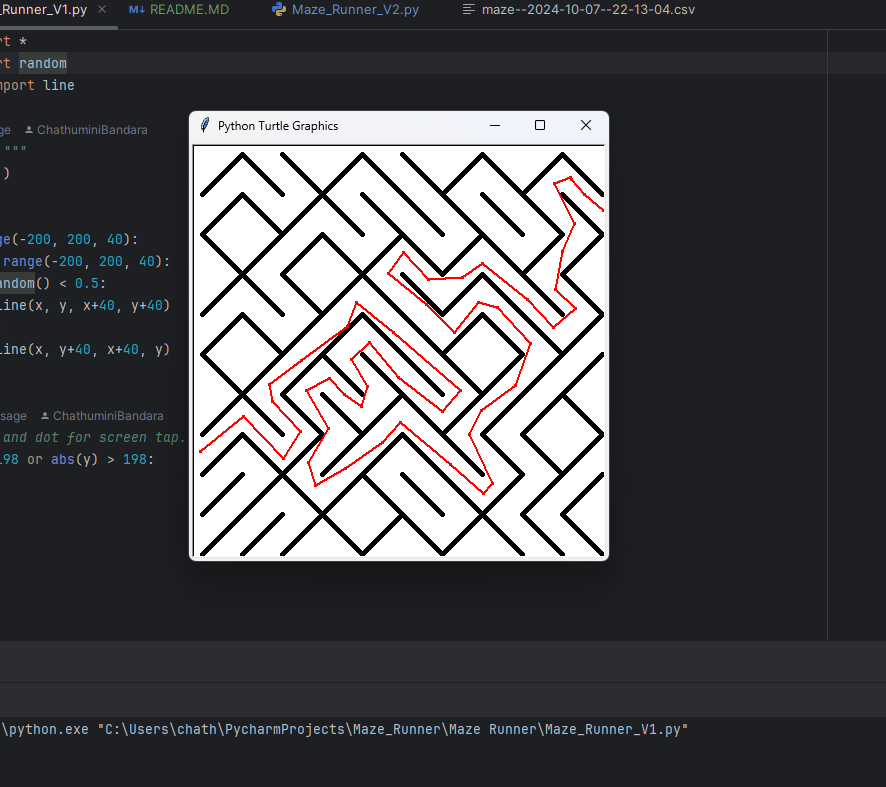
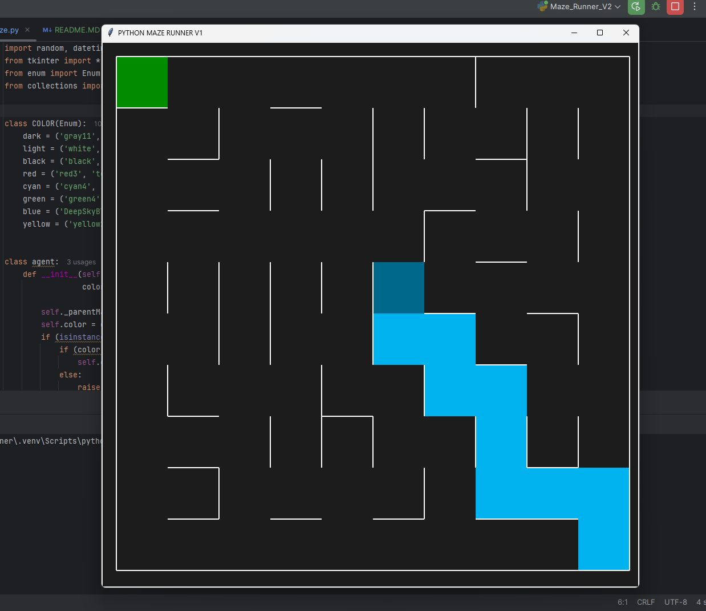

---

# Python Maze Runner 🏃‍♂️

## Overview 🪄
This Python-based maze game offers two distinct gameplay versions, providing both a creative and interactive control system:

1. **Version 1**: Players navigate through a pre-generated maze using arrow keys.
2. **Version 2**: A draw maze where players create the maze themselves by drawing dots that connect to form paths.

Both versions utilize the **PyMaze** library for maze generation and **Tkinter** for graphical rendering. Additionally, the game logs player performance (completion time, moves) in a CSV file for tracking progress and results.

## Features 🪄
- **Two Game Versions**:
  - **Version 1**: Navigate the maze using arrow keys for direct control.
  - **Version 2**: Draw your own maze by clicking to place dots that automatically connect, creating a path.
- **Random Maze Generation**: Each game generates a fresh and unique maze.
- **Score Tracking**: Your performance (e.g., completion time, number of moves) is saved in a CSV file for future reference.
- **GUI Interface**: Built with **Tkinter** to create an intuitive and simple graphical interface.
- **Optimized Data Structures**: Uses efficient data structures like `deque` and `enum` to handle navigation and drawing efficiently.

## Technologies Used 🪄
- **Python**: The core language used for the game.
- **PyMaze**: For the generation and solving of mazes.
- **Tkinter**: For rendering the GUI and handling user interactions.
- **random**: To generate random elements in the maze.
- **csv**: To store player performance data.
- **datetime**: For tracking and logging the game time.
- **os**: For handling file paths and operations.
- **deque**: Used for efficient queue operations in pathfinding and maze-solving algorithms.

## How to Run ❓
1. Clone the repository:
    ```bash
    git clone <https://github.com/ChathuminiBandara/Maze_Runner>
    ```
2. Install the dependencies:
    ```bash
    pip install pymaze
    ```
3. Run the game:
    ```bash
    python maze_game.py
    ```

## How to Play ❓
- **Version 1 (Draw Maze)**:
  Click on the interface to draw dots, which will automatically connect to form the maze paths.

- **Version 2 (Arrow Key Navigation)**:
  Use the arrow keys to navigate through the maze and reach the goal.
  

## CSV Data
After each game, the performance data is logged into a file named `maze_data.csv`, which includes:
- Completion time
- Number of moves
- Timestamp of the game session

## Images
Images showcasing both versions of the game will be added soon:
- **Version 1 (Arrow Key Navigation)**:
  
  
- **Version 2 (Draw Maze)**:
  

## Future Enhancements ⚔️👌
- Additional difficulty levels.
- Implementing a scoring system based on efficiency and time.
- Adding competitive multiplayer modes.

---

